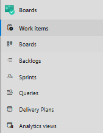
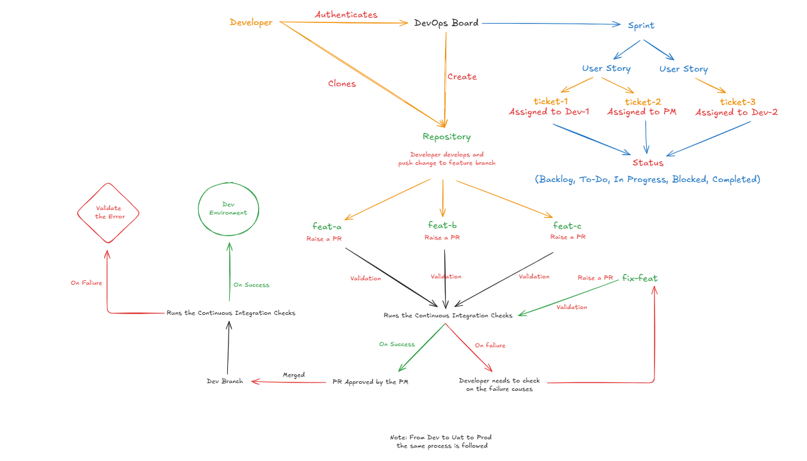

Azure DevOps Boards is a work tracking and project management service in Azure DevOps.
It helps teams plan, track, and manage work across the entire development lifecycle using Agile, Scrum, or Kanban methodologies.

In short 👉 Boards tell you what work is happening, who is doing it, and when it will be delivered.

## Core Components of Azure DevOps Boards
### 📝 Work Items

Work items represent units of work.

**Common types**

- Epics – Large business goals
- Features – Major functionalities
- User Stories / Product Backlog Items (PBIs)
- Tasks – Actionable development work
- Bugs – Defects to be fixed

**What work items support**

- Priority & state tracking
- Assigned users
- Due dates & estimates
- Comments, attachments, and history

### 📋 Boards

Visual boards to track work progress.

**Key features**

- Columns like To Do → In Progress → Done
- Drag-and-drop work items
- WIP (Work In Progress) limits
- Swimlanes for prioritization

**Benefits**

- Real-time visibility
- Bottleneck identification
- Continuous delivery support

### 📚 Backlogs

Hierarchical view of planned work.

**Backlog levels**

- Epic → Feature → User Story / PBI → Task

**Benefits**

- Clear prioritization
- Long-term roadmap planning
- Easy refinement & grooming

### 🏃‍♂️ Sprints

Time-boxed iterations for delivering work.

**Sprint capabilities**

- Sprint planning
- Capacity management
- Task breakdown
- Burndown charts

**Benefits**

- Predictable delivery
- Better team focus
- Incremental value delivery

### 🔍 Queries

Custom filters to find and track work items.

**Examples**

- Bugs assigned to me
- High-priority items not started
- Overdue tasks

**Benefits**

- Personalized views
- Advanced reporting
- Automation triggers

### 🗺️ Delivery Plans

High-level timeline view across teams and projects.

**Key features**

- Cross-team planning
- Dependency tracking
- Milestone visibility

**Best for**

- Program managers
- Release managers
- Stakeholder reporting

### 📊 Analytics Views

Data models for reporting and insights.

**What it provides**

- Lead time & cycle time
- Velocity trends
- Work item aging

**Benefits**

- Data-driven decision making
- Continuous improvement insights
- Integration with Power BI

## How Azure DevOps Repos fit into DevOps

