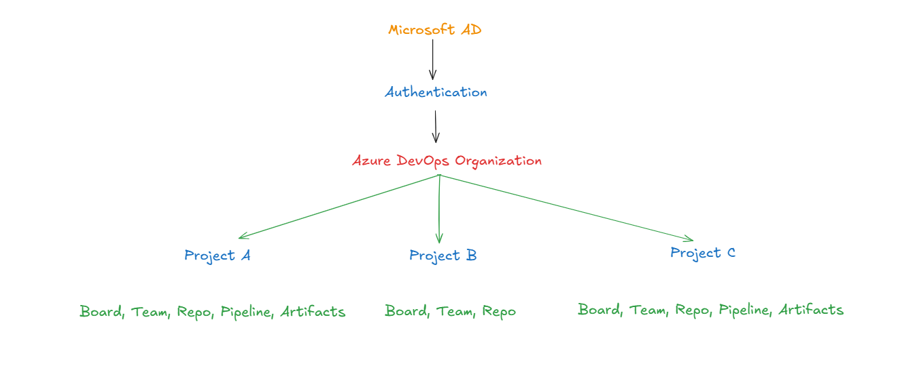

# Azure DevOps

Azure DevOps is a cloud-based DevOps platform by Microsoft that provides
a complete set of tools to plan, build, test, and deploy applications.
It helps teams collaborate efficiently across the entire software
development lifecycle (SDLC)—from idea to production.

It supports modern development practices such as Agile planning,
CI/CD automation, version control, testing, and monitoring, making it
suitable for startups, enterprises, and distributed teams alike.

## What is Azure DevOps?

Azure DevOps is a suite of integrated services that enables developers,
DevOps engineers, testers, and project managers to work together using
a shared toolchain.

It can be used:

- As a fully cloud-hosted service (Azure DevOps Services)
- Or on-premises (Azure DevOps Server)

## Key Features of Azure DevOps

Azure DevOps is made of five core services:

### Azure Boards

- Agile project management
- Work items: Epics, Features, User Stories, Bugs, Tasks
- Kanban boards & Scrum backlogs
- Sprint planning & tracking

### Azure Repos 

- Source code management
- Supports Git management
- Branching Strategies 
- Pull requests, code reviews and policies 

### Azure Pipelines

- CI/CD automation
- Build and release pipelines
- YAML or classic pipelines
- Supports Docker, Kubernetes, Terraform, ARM, etc.
- Works with any language or platform

### Azure Tests Plans 

- Manual and exploratory testing
- Test case mangement
- Integration with Board & Pipelines 
- Bug tracking linked to test cases 

### Azure Artifacts

- Package Management
- Secure artifacts feeds

## What is an Azure DevOps Organization?

An Azure DevOps Organization is the top-level container in Azure DevOps.

***Think of it as:***

*A company or team account that owns projects, users, pipelines, and repositories.*

#### An Organization contains:

- One or more Projects
- Users and Groups
- Permissions and policies
- Billing and extensions

**📌 Every project must belong to an organization**

## How to Create an Azure DevOps Organization

#### Prerequisties 

- Microsoft account or Azure AD account
- Internet access

#### Steps
1. Go to: 👉 [DevOps Board Link](https://dev.azure.com)
2. Sign in with your Microsoft / Azure AD account
3. Click “Create new organization”
4. Choose:
    - Organization name (must be unique)
    - Region (important for compliance & performance)
5. Click Continue

✅ Your Azure DevOps Organization is now created

## How to Add Users to an Azure DevOps Organization

#### Steps
1. Open your Azure DevOps Organization
2. Go to Organization settings
3. Select Users
4. Click Add users
5. Enter:
    - Email address
    - Access level (Basic / Stakeholder)
6. Click Add

#### Common Access Levels

- Basic – Full access to repos, boards, pipelines
- Stakeholder – Limited access (mostly Boards)
- Basic + Test Plans – Includes test management

## How to Create a Project in Azure DevOps

#### Steps

1. Open your Azure DevOps Organization
2. Click New Project
3. Provide:
    - Project name
    - Visibility:
        - Private (recommended)
        - Public
    - Version control:
        - Git
    - Work item process:
        - Agile / Scrum / CMMI
4. Click Create

**🎉 Your project is ready!**

## What is an Azure DevOps Project?

An Azure DevOps Project is where actual development work happens.

A project contains:

- Repositories (code)
- Pipelines (CI/CD)
- Boards (work items)
- Test plans
- Artifacts

Each project is isolated, making it easy to manage multiple applications within the same organization.

## Typical Azure DevOps Hierarchy

