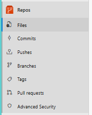

# Azure DevOps Repositories

Azure DevOps Repositories (commonly called Repos) is the source control service inside Azure DevOps.
It’s where your application code, configuration files, and documentation live—securely versioned and ready for collaboration.

Think of it as GitHub + enterprise controls, tightly integrated with pipelines, boards, and releases.

## What Azure DevOps Repos does

Azure DevOps Repos lets teams:

- Store code centrally
- Track every change (who, what, when, why)
- Collaborate using pull requests
- Enforce code quality with branch policies
- Integrate directly with CI/CD pipelines

## Types of repositories in Azure DevOps

### Git Repositories (Most Common)

Modern, distributed version control.
Features
- Branching (main, develop, feature/*)
- Pull Requests (PRs)
- Code reviews & approvals
- Merge strategies (merge, squash, rebase)
- Works with VS Code, Visual Studio, IntelliJ, Git CLI

Best for:
Modern DevOps, microservices, CI/CD-first teams

### Team Foundation Version Control (TFVC)

Centralized version control (older model).
Features
- Check-in / check-out
- Single central repository
- No local history like Git

Best for:
Legacy enterprise projects

⚠️ Not recommended for new projects

## Repo Management 

### New Repository

Use this option when you want to create a repository from scratch inside your Azure DevOps project.

**Key Points**

- Creates an empty repository or one with a default README
- Supports Git and TFVC
- Ideal for new projects or fresh microservices
- Repository is immediately available for:
    - Cloning
    - Branch creation
    - CI/CD pipeline integration

**Common use case**

Starting a brand-new application or service within an existing DevOps project.

### Import Repository

Use this option when you want to bring existing code into Azure DevOps Repos.

**Key points**

- Imports code from external Git sources such as:
    - GitHub
    - Bitbucket
    - GitLab
    - Another Azure DevOps project
- Preserves full commit history
- Requires repository URL and access credentials (if private)
- Useful for migrating projects into Azure DevOps

**Common use case**

Moving an existing repository from GitHub into Azure DevOps for centralized CI/CD and governance.

## Core Components of Azure DevOps Repos

### 📁 Repository

- A container for your source code
- Each project can have multiple repositories

### 🌿 Branches

- Parallel versions of code
    - main / master
    - develop
    - feature/login
    - hotfix/bug-123

### 🔁 Pull Requests (PRs)

- Request to merge code from one branch to another
- Enables:
    - Code review
    - Approval workflows
    - Build validations

### 📝 Commits

- Snapshots of code changes
- Includes:
    - Author
    - Timestamp
    - Commit message

### 🏷️ Tags

- Mark important versions like v1.0, release-2026

## How Azure DevOps Repos fit into DevOps

## Key Advantages

- Cloud-hosted & secure
- Unlimited private repositories
- Fine-grained access control
- Built-in code reviews
- Deep integration with Pipelines, Boards & Artifacts